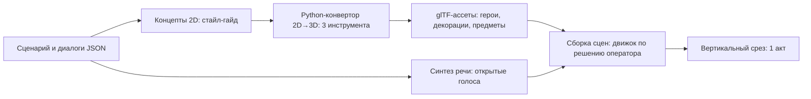

# HLD: «Поручик Ржевский против Ордена» — юморной квест XIX века, 2D-стиль → 3D (версия 0.2, 2026-10-03, репозиторий ludus)

> **Сведено 2026-10-03:** серия называется «Ржевский и Ложа Трёх Циркулей»; действующие решения обеих версий — в [`rzhevsky/README.md`](../rzhevsky/README.md).

**Заказ оператора (дословно, 2026-10-03):** «изучить движки, вытащить тексты, вторую серию делаем юморной. Герои разбираются с страшным приором и орденом юмором… Героев всех через конвертацию сделай в 3d все декорации и предметы тоже… питон конвертацией. Выбери три инструмента конвертации из 999 по 32 параметрам проекта. Сделай аналогичный сценарий смешав жанры игр в юморной манере» → «Давай поручик Ржевский» → «Ищи из Петьки и Василия Ивановича стиль… переноси на поручика Ржевского против ордена» → «И приора» → «Следующий 19 век» → «Пиши hld и го».

**Статус:** v0.2 — внесены выбор инструментов, голоса, герои и сценарий из исследования [`docs/RZHEVSKY_RESEARCH_2026-10-03.md`](RZHEVSKY_RESEARCH_2026-10-03.md) (движки, метод извлечения, 12 инструментов × 32 параметра, сценарий, стайл-гайд, источники по ГОСТ).

## 1. Что это и чем не является

- **Новая отдельная IP**, оригинальный юморной point-and-click квест со смешением жанров. Герой — фольклорный поручик Ржевский (народный образ анекдотов) в **своём** облике; антагонисты — вымышленные **страшный приор** и **тайный орден** XIX века.
- **Не** продолжение «Петьки и Василия Ивановича», «ГЭГа» или «Братьев Пилотов»: их тексты, графика и герои — собственность правообладателей (Бука, S.K.I.F., Gamos) и в игру не входят. От «Петьки» переносим только **приёмы стиля** (стиль авторским правом не охраняется), не изображения.
- **Не** связана с литургическим корпусом и игрой Webtypicon2 (ТАБУ №1 игрового модуля): орден и приор — светские/фэнтезийные, без церковной атрибутики, без насмешки над верой; реальные исторические лица не очерняются.

## 2. Правовые границы (обязательны для всех фаз)

| Можно | Нельзя |
|---|---|
| Фольклорный Ржевский — своя внешность, свой характер, семейный юмор | Облик и голос актёров (Яковлев и др.), сцены пьесы Гладкова «Давным-давно» и фильма Рязанова |
| Приёмы стиля «Петьки»: рисованный 2D, карикатура, палитра, ракурсы | Кадры, спрайты, локации, реплики игр Буки/S.K.I.F./Gamos |
| Синтез речи с коммерческой лицензией и **неклонированным** тембром | Клон голоса Шуры Каретного, актёров, любого реального человека |
| Изучение движков ScummVM/freegag (GPL) и извлечение данных из **лично купленных** копий — только для изучения | Пиратские копии игр; чужие ассеты в публикуемой игре |
| Проверка товарного знака «Поручик Ржевский» до релиза | Релиз без этой проверки |

## 3. Архитектура

- **Данные, не код движка, в первых фазах** (как у «Рыцарей»): сценарий, диалоги, листы персонажей, манифест ассетов — JSON/YAML; в песочнице нет Unity/Unreal, компилируемый игровой код здесь не пишется и не выдаётся за проверенный.
- **Конвертор 2D→3D на Python** (ТАБУ «скрипт вместо перевода», «Python на дев-сервере кусками»): спрайт/концепт → маска → 3D-модель (выбранный инструмент) → чистка топологии → glTF → проверка (полигоны, текстуры, масштаб) → манифест. Пакетно, детерминированно, с отчётом; тяжёлое (GPU) — на раннере/машине с видеокартой, не в песочнице.
- **Голоса:** синтез речи с открытой лицензией, свои тембры; реплики из диалогового JSON → WAV по шаблону `audio/dialogue/{npcId}/{nodeId}.wav`.
- **Движок сборки сцен — Godot 4** (уже в ludus: `godot/`, сборка APK для Quest 3 по ТАБУ №0.01); каждая сцена проходит ревизора лимитов APK (ТАБУ №0.011).

## 3а. Решения v0.2 (по исследованию; оценки — суждения, не замеры)

| Что | Выбор | Почему / ограничение |
|---|---|---|
| 2D→3D: декорации | Blender + Depth Anything V2 **Small** (карта глубины → рельеф) | Лицензия Small — Apache-2.0; большие модели — некоммерческие, не брать |
| 2D→3D: предметы | **TripoSR** (MIT) | Быстро, одна картинка → сетка; на CPU медленно, на GPU секунды |
| 2D→3D: герои | **TRELLIS** (MIT) | Лучшая геометрия; нужно ≥16 ГБ видеопамяти — не на Orin, только машина с GPU |
| Исключены | Hunyuan3D-2 (лицензия не действует в ЕС — Варшава), Zero123++, большие Depth Anything (некоммерческие), клонирующие голос XTTS/F5-TTS | — |
| Голос | **Piper** (основной), **RHVoice** (запасной) | Лицензии конкретных голосовых моделей ещё не проверены — проверить до релиза |
| Герои | Поручик Ржевский (свой облик), денщик **Бублик**; антагонист — приор **Мглин**, **Орден Серебряной Печати** | Оригинальные; вместо телефонных розыгрышей — «переговорные трубы» эпохи |
| Жанры | Квест + стелс + ритм-кулинария + гонки (дилижансы) | 5 актов, 15 локаций, 30 загадок — по исследованию, §4 |

Отличие от рекомендации исследования: оно советовало отдельный репозиторий без связи с ludus; решение оператора — **только ludus** («В ludus это комит только»), поэтому действуют Конституция ludus и правила APK (§4, §4а).

Не сделано и ждёт данных: извлечение из игр (нужны лично купленные копии; скрипты только описаны), проверка товарного знака «Поручик Ржевский» в ФИПС/WIPO.

## 4. Где живёт (оператор: «В ludus это комит только»)

- Только репозиторий **ludus**: этот HLD — `docs/HLD_RZHEVSKY_VS_ORDER_2026-10-03.md`; данные и конвертор — `rzhevsky/` (сценарий, JSON, манифест, концепты, Python-конвертор); сцены — в `godot/` (APK для Quest 3 по ТАБУ №0.01) только после фазы 3.
- В webtypicon2 ничего по игре не коммитится.
- Тяжёлые бинарные ассеты (исходные glTF, текстуры, WAV) — по правилам ludus и ревизору лимитов APK (ТАБУ №0.011): в APK идёт только то, что укладывается в бюджеты `scripts/godot/apk-budgets.json`.

## 4а. Конституция ludus (ТАБУ №0, проверка решения)

Конституция: ФОРМА (Ржевский, приор и рыцари ордена несут 7 атрибутов: Wisdom, Faith, Dexterity, Constitution, Charisma, Cunning, Erudition; балагурство Ржевского — это Charisma и Cunning, страх приора — гордыня без Wisdom) → ДЕЙСТВИЕ (врата — диалог, атрибут и действие вместе; юмор как оружие против гордыни и страха, без случайных наград) → ЦЕЛЬ (учение через смех: смирение побеждает гордыню, страх рассеивается правдой и милостью, а не силой). Если у механики нельзя написать такую строку, её не делают.

## 5. Фазы (вертикальный срез сначала)

| Фаза | Результат | Критерий готовности |
|---|---|---|
| 0 | Исследование: движки, метод извлечения, 3 инструмента 2D→3D, голоса, стайл-гайд, сценарий (отчёт агента) | МД оператору, решения по §7 |
| 1 | Данные акта I: сценарий, диалоги JSON, листы Ржевского, приора, рыцарей ордена, 4 локации | Схема JSON валидна, юмор-ревью оператора |
| 2 | Концепты 2D акта I в стиле (свои изображения) | 10–15 концептов, проверка «не узнаваемо как чужое» |
| 3 | Python-конвертор 2D→3D + пакет акта I → glTF | Отчёт конвертора, просмотр моделей |
| 4 | Голоса акта I (открытый TTS) | WAV по всем репликам акта I |
| 5 | Вертикальный срез в движке: 1 акт играбелен | Сборка + видео прохождения |
| 6 | Остальные акты, жанровые мини-игры | По плану сценария |

## 6. Смешение жанров (каркас, уточняется сценарием)

Point-and-click квест (основа) + стелс на балу/в усадьбе + тактическая «дуэль остроумия» с приором + мини-игры эпохи (почтовая станция, дилижанс, ярмарка, ранние «чудеса» — паровоз, телеграф, дагерротип — для анахроничного юмора).

## 7. Решения оператора

1. Решено: Godot 4 в ludus (APK для шлема).
2. Тяжёлые исходники ассетов: Google Drive или LFS в ludus — по правилам ludus.
3. Три инструмента 2D→3D и 1–2 голоса — по таблице отчёта агента.
4. Нужны ли купленные копии игр для изучения (только референс, не в игру).

## 8. Риски

- **Права**: узнаваемость стиля/героев — проверка на каждом концепте; товарный знак «Поручик Ржевский» — проверить до релиза.
- **Железо**: 2D→3D-модели требуют GPU; в песочнице не идут.
- **Качество**: рисованные спрайты дают слабую геометрию сзади — нужна ручная доводка в Blender или многовидовые концепты.
- **Объём**: 15 локаций и 30 загадок — только поэтапно, через вертикальный срез.
