# Сюита «Наука. Любовь. Познание.»: космическая музыка Ludus

**Запрос оператора (2026-10-02, дословно):** «Наука Любовь познание напиши космическую музыку фоном к игре. Аналог космическую музыку Эдуарда Артемьева»; «Документируй музыку в отдельную папку с картинками и подробно как собирал чтобы повторить».

**Конституция:** ФОРМА (девять узлов Энтелехии и их звук) → ДЕЙСТВИЕ (каждая часть серии звучит музыкой своего узла; выбор слышен как схождение или расхождение голосов) → ЦЕЛЬ (наука как метод, любовь как мотив, познание как процесс — признак IX.8 Конституции).

В этой папке:
- что звучит и почему;
- точные числа каждого узла;
- как собрать всё с нуля одной командой;
- картинки, по которым видно устройство сюиты.

Звука в репозитории нет: тест `scripts/raw_assets/tests/test_audio_pass.py` запрещает аудио в `docs/`. Его каждый раз заново собирает скрипт (раздел 4).

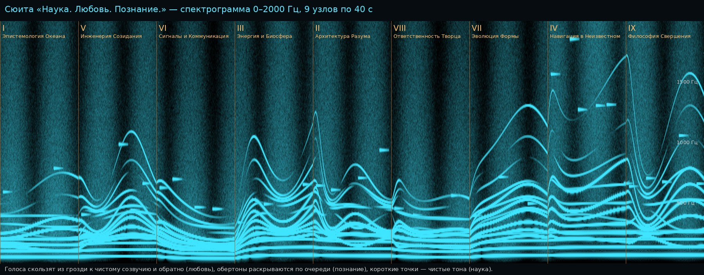

## 1. Что это и чем это не является

- **Это живой синтез, а не запись.** Шлем считает музыку сам: `godot/scripts/audio/cosmos_synth.gd` (класс `CosmosSynth`), 16 кГц, стерео. Звука в APK 0 байт, сеть не нужна.
- **Аналог Артемьева — по приёму, не по нотам.** Артемьев писал «Солярис», «Сталкер» и «Сибириаду» на синтезаторе АНС Е. Мурзина. Это фотоэлектронный инструмент: звук рисуется на стеклянной пластине чистыми синусоидами, по 72 ступени на октаву, и гроздья тонов медленно скользят и расцветают. Здесь используется тот же приём: синусы, 72 ступени, глиссандо и медленное раскрытие. **Ни одной его темы и ни одного хорала Баха здесь нет.**
- **Чего нет по правилам игры:**
  - формантных «хоров», то есть подражания церковному пению (ТАБУ №0.2 п. 5);
  - негармонических колокольных обертонов (колокол в игре один, по уставу);
  - случайности (Конституция): шум и «звёзды» идут из целочисленного генератора xorshift, seed — имя узла плюс 1375.

## 2. Пять слоёв и что каждый значит

| Слой | Смысл | Устройство |
|---|---|---|
| **Любовь — мотив** | Притяжение, которое стягивает разное в согласие (IX.7) | 6 синусовых голосов. В начале цикла голос стоит на ступени `cluster` 72-ступенной сетки от `center_hz`. К середине цикла он геометрически скользит к чистому отношению `target` (1, 5/4, 3/2, 2…), к концу цикла возвращается. Сила притяжения — `love` (0–1). Формула: f = f_гроздь · (f_созвучие / f_гроздь)^g, где g = love · (1 − cos 2πt/T)/2. |
| **Познание — процесс** | Спектр раскрывается по мере узнавания | У каждого голоса есть октавный обертон. Его громкость `unfold` · 0,4 · (1 − cos 2π(t/T + v/6))/2: обертоны расцветают по очереди, голос за голосом. |
| **Наука — метод** | Мерить тьму по одной точке | Редкие чистые тона на сетке простых отношений `sparkle` от `center_hz`: атака 0,35 с, спад τ = 1,6 с, не больше трёх сразу, частота `sparkle_per_min`. На узле VI каждому тону отвечает эхо через 1,2 с с другой стороны: звук гнётся на границе термоклина. |
| **Гул** | Основание, низ | Корень `root_hz` с гармониками 1–4 (веса 1; 0,6; 0,35; 0,2), чтобы низ был слышен и на маленьких динамиках шлема (ТАБУ №0.4 п. 13). Медленно дышит с периодом 31 с. |
| **Ветер глубины** | Среда, вода и пустота | Полосовой шум: фильтр нижних частот на `wind_hz` минус фильтр на четверти этой частоты. Отдельный генератор на каждое ухо. Дышит с периодом 23 с. |

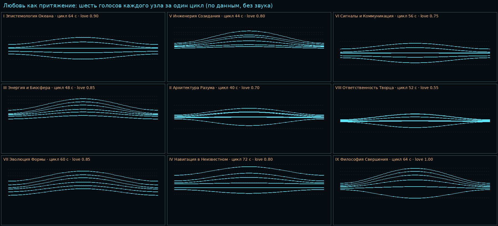

*Картинка посчитана по данным, без звука: шесть голосов каждого узла за один цикл. Пунктир — чистые отношения, к которым голоса тянутся. В узле VIII (`love` 0,55) голоса сходятся только наполовину: выбор ещё не сделан. В узле IX (`love` 1,0) созвучие полное.*

## 3. Девять узлов: точные числа

Данные — `godot/data/entelechy-99.json`, единственный источник — `scripts/story/entelechy.py` (`NODES[...]['cue']`). Порядок таблицы — порядок пилота.

| Узел | Название | Биты пилота | root, Гц | center, Гц | cluster (ступени из 72) | target (отношения) | цикл, с | love | unfold | гул | ветер: уровень % / полоса до | звёзд/мин | sparkle (отношения) | эхо |
|---|---|---|---|---|---|---|---|---|---|---|---|---|---|---|
| I | Эпистемология Океана | drop, water_rises, immersion, hands_on_stick | 49.0 | 196.00 | -37 -20 -1 0 3 23 | 0.5 0.75 1 1 1.5 2 | 64 | 0.90 | 0.60 | 0.90 | 55 / 380 Гц | 3 | 2 3 4 | 0.00 |
| V | Инженерия Созидания | walls | 55.0 | 220.00 | -12 -4 0 2 12 19 | 1 1.125 1.5 2 2.25 3 | 44 | 0.80 | 0.90 | 0.70 | 30 / 700 Гц | 6 | 2 3 4.5 | 0.00 |
| VI | Сигналы и Коммуникация | thermocline | 36.7 | 146.83 | -30 -18 -2 0 6 25 | 0.5 0.75 1 1 1.5 2 | 56 | 0.75 | 0.50 | 1.00 | 45 / 300 Гц | 4 | 3 4 | 0.45 |
| III | Энергия и Биосфера | tether_jerk | 65.4 | 261.63 | -25 -8 0 4 9 30 | 1 1.25 1.5 2 2.5 3 | 48 | 0.85 | 1.00 | 0.80 | 40 / 600 Гц | 4 | 2 2.5 3 | 0.00 |
| II | Архитектура Разума | bookmark | 58.3 | 233.08 | -13 -6 -1 1 7 12 | 0.5 1 1 1.5 1.5 2 | 40 | 0.70 | 0.80 | 0.60 | 25 / 900 Гц | 8 | 2 2.5 3 4 | 0.00 |
| VIII | Ответственность Творца | lure, price_rises, choice_echo | 46.2 | 185.00 | -7 -5 -1 1 5 7 | 0.5 1 1 1.5 2 2 | 52 | 0.55 | 0.60 | 0.90 | 50 / 260 Гц | 2 | 2 3 | 0.00 |
| VII | Эволюция Формы | diary, mark_line | 61.7 | 246.94 | -48 -26 -9 0 17 40 | 1 1.2 1.5 2 2.4 3 | 60 | 0.85 | 1.00 | 0.70 | 35 / 500 Гц | 5 | 2 2.4 3 | 0.00 |
| IV | Навигация в Неизвестном | ascent | 65.4 | 329.63 | -42 -30 -7 0 12 47 | 0.5 0.75 1 1.5 2 3 | 72 | 0.80 | 0.70 | 0.70 | 30 / 2200 Гц | 10 | 2 3 4 6 | 0.00 |
| IX | Философия Свершения | room_drains, prior_last, title | 65.4 | 261.63 | -19 -10 -2 3 11 21 | 0.5 1 1.5 2 2.5 3 | 64 | 1.00 | 0.90 | 0.80 | 30 / 800 Гц | 5 | 2 2.5 3 4 | 0.00 |

- **Хачкар (бит khachkar):** своей музыки нет. Плеер музыки уходит к −60 дБ вместе с пультом (`pilot.gd`, `_music`), как любой машинный звук у святыни (ТАБУ №0.4 п. 2).
- **Рассказчик и инсайт:** музыка уступает рассказчику (`duck_db`) и инсайту (половина его приглушения).
- **Переход между узлами:** звук не обрывается. Каждое число картины за `MORPH_S` = 8 с переходит к новому, и голоса «переезжают» к следующему узлу.

**Узлы по отдельности** (40 с каждый, 0–2000 Гц):

| | | |
|---|---|---|
| 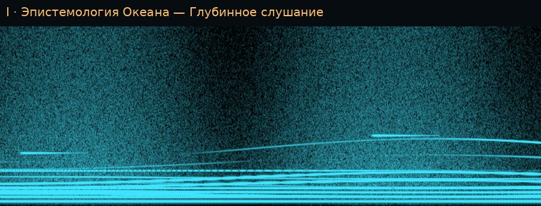 | 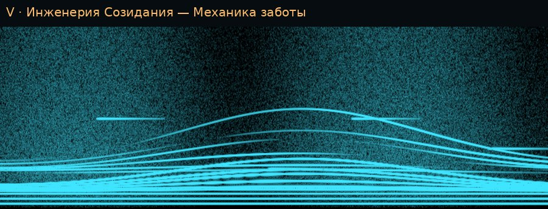 | 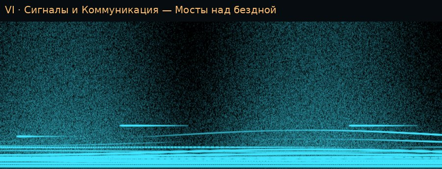 |
| 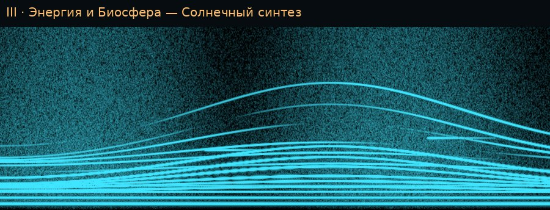 | 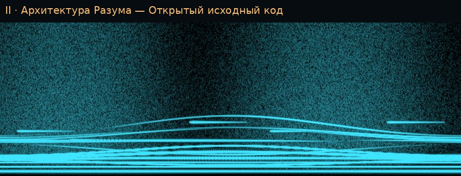 | 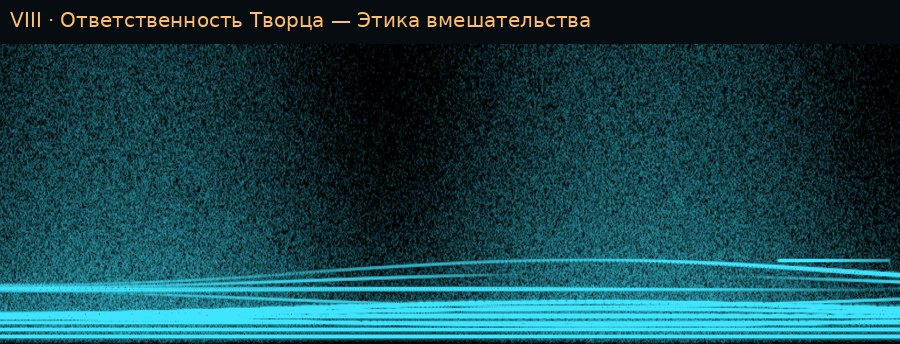 |
| 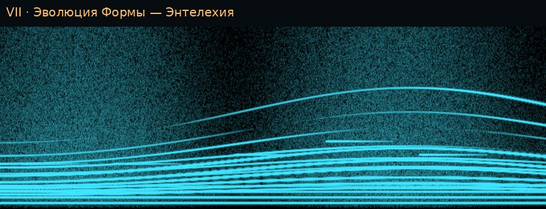 | 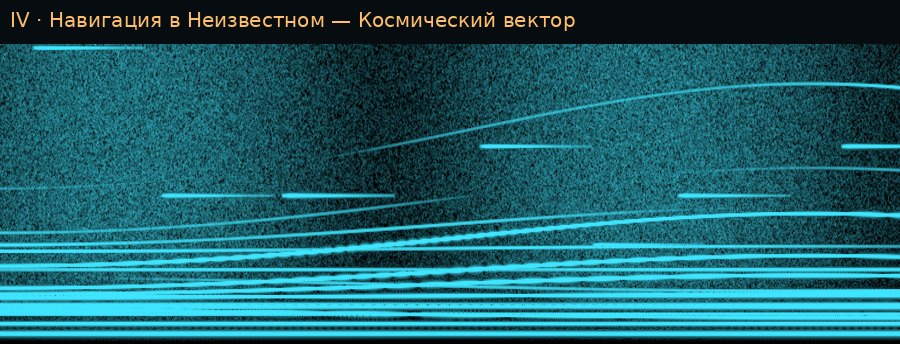 | 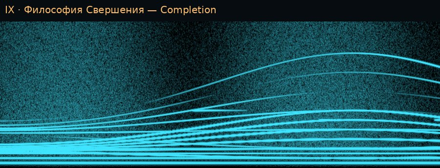 |

## 4. Как собрать с нуля (повторить в точности)

**Что нужно:**
- Godot 4.7.1 editor для Linux (`Godot_v4.7.1-stable_linux.x86_64`, тот же, что в CI: `scripts/godot/ci_setup.sh`);
- Python 3 с `numpy` и `Pillow`;
- `ffmpeg` с кодером `libmp3lame`;
- шрифт DejaVu Sans (для подписей на картинках).

**Одна команда из корня репозитория:**

```bash
GODOT=/путь/к/Godot_v4.7.1-stable_linux.x86_64 python3 scripts/music/cosmos_preview.py
# повторно, без нового рендера:
python3 scripts/music/cosmos_preview.py --skip-render
```

**Что делает скрипт** (`scripts/music/cosmos_preview.py`, PEP 8), шаг за шагом:

1. **Рендер в Godot.**
   - Команда: `godot --headless --path godot --script res://tools/render_cosmos.gd -- --out=build/music/cosmos --seconds=40`.
   - Рендер идёт тем же `CosmosSynth`, что звучит в шлеме.
   - Выход: `cosmos-<узел>.wav` по 40 с на каждый узел и `suite.wav` (9 узлов подряд в порядке пилота, с морфом между ними). Формат 16 кГц, 16 бит, стерео.
   - Печать: сколько процессорного времени ушло.
2. **Превью-реверберация.**
   - В шлеме реверберацию даёт `AudioEffectReverb` движка на шине `Music`: room_size 0,9, damping 0,6, wet 0,35, dry 0,8, затем лимитер −1 дБFS. Без экрана её не записать.
   - Поэтому превью свёрнуто с шумовым откликом 3,5 с (спад τ = 0,9 с, seed 1375), отдельно для каждого уха: 0,7 сухого + 0,45 влажного.
   - **Это приближение, в шлеме звучит иначе.**
3. **Уровень.**
   - Прослушивательная копия приводится к −16 LUFS (BS.1770-4, `scripts/godot/loudness.py`). Истинный пик — не выше −1 dBTP.
   - В игре сюита — подложка около −26 LUFS, на 10 LU тише микса погружения.
4. **MP3.** `ffmpeg -ar 44100 -c:a libmp3lame -q:a 2` (VBR около 190 кбит/с), с тегами названия → `build/music/cosmos/nauka-lyubov-poznanie.mp3`.
5. **Картинки** → `docs/music/cosmos/`:
   - спектрограмма сюиты и каждого узла (окно Ханна 2048, шаг 512, порог −40 дБ, диапазон 45 дБ, 0–2000 Гц);
   - глиссандо голосов по данным;
   - громкость узлов.

**Проверки, которые держат сюиту:**

```bash
python3 scripts/story/entelechy.py --check          # 99 признаков = CLAUDE.md, данные = источник
# в godot/: тест сюиты и пилота
godot --headless --path godot --script res://tests/run_hub_tests.gd
#   test_cosmos.gd: 9×11 = 99; только чистые отношения; тот же звук каждый раз;
#   пик ниже −6 дБFS; морф между узлами; ни randf, ни randi
#   test_pilot_scene.gd: все 9 узлов звучат за серию; у хачкара музыка ≤ −59 дБ
python3 scripts/godot/loudness.py build/music/cosmos/*.wav
```

## 5. Замеры (2026-10-02, компьютер сессии)

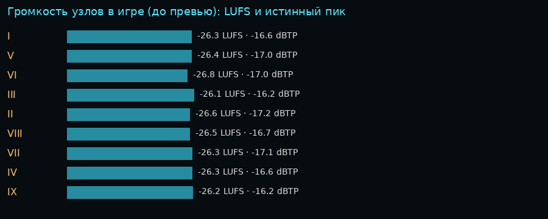

| Мера | Значение | Чем снято |
|---|---|---|
| Громкость узлов в игре | −26,1…−26,8 LUFS, истинный пик −16,2…−17,2 dBTP | `loudness.py` |
| MP3 для прослушивания | −16,0 LUFS, пик −4,1 dBTP, 6 мин 3 с | `cosmos_preview.py` |
| Процессор | 360 с звука за 16,5 с: 4,6 % одного ядра компьютера | `render_cosmos.gd` |
| В шлеме | оценка [В]: 1–2 мс кадра при 72 Гц | **подтвердит только Quest 3** |
| Вес в APK | 10,4 КБ скрипта + 18,9 КБ данных, звука 0 Б | `wc -c` |

## 6. Что ещё открыто

1. Слух оператора: близко ли к Артемьеву? Чего прибавить: «воздуха» (`wind`), «звёзд» (`sparkle_per_min`) или замедлить скольжение (`cycle_s`)? Каждое из этих чисел — одна строка в `scripts/story/entelechy.py`.
2. Лейтмотив кометы, сквозной для всех эпох, или узлы без мелодии, как на АНС.
3. Сюита в сцене замка и в хабе — пока она звучит только в пилоте.
4. Если в шлеме окажется тесно для процессора, синтез переносится в `WorkerThreadPool` или частота снижается до 11 025 Гц.
